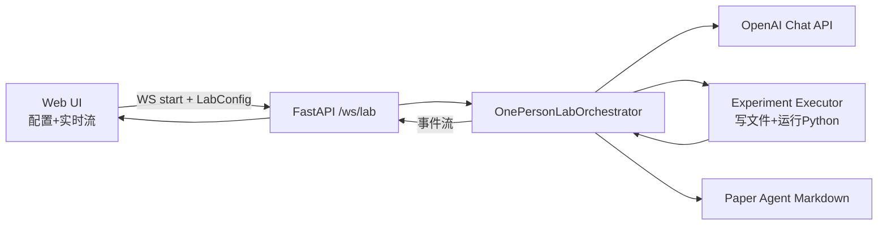
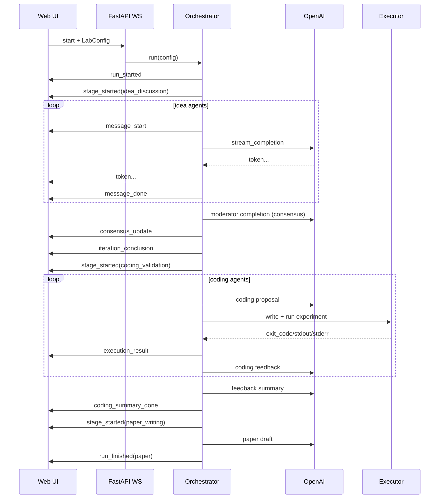

# One-Person Lab 架构设计文档

版本: v0.1
更新时间: 2026-03-19
适用代码: `main` 分支当前实现

## 1. 目标与边界

### 1.1 目标

本系统用于落地一个可运行的多智能体研究实验室，核心流程是:

1. 多个讨论智能体围绕研究主题进行多轮辩论，形成阶段性结论。
2. 多个编码智能体基于结论生成可执行实验并真实运行。
3. 将实验结果反馈回讨论组，驱动下一轮迭代。
4. 若干轮后交由论文智能体生成研究草稿。

### 1.2 非目标

1. 不做结果“打分游戏”或 mock 评分。
2. 不伪造实验日志，执行失败会原样进入结论与论文。
3. 当前不做强隔离沙箱（执行器已有限制，但不是容器级安全沙箱）。

## 2. 总体架构



## 3. 代码模块分层

| 层 | 文件 | 职责 |
|---|---|---|
| 接入层 | `app/main.py` | HTTP + WebSocket 接入, 环境加载, 启动编排 |
| 编排层 | `app/orchestrator.py` | 三阶段循环、上下文汇总、事件发射 |
| 模型层 | `app/openai_client.py` | 统一模型调用、流式 token 推送、参数兼容 |
| 执行层 | `app/execution.py` | 提取代码块、落盘执行、收集 stdout/stderr |
| 配置层 | `app/schemas.py` | Pydantic 配置模型、默认 paper agent 补全 |
| 前端层 | `app/templates/index.html`, `app/static/app.js` | 配置 UI、实时事件渲染 |
| 运维脚本 | `scripts/live_run.py` | CLI 直接发起真实实验 |

## 4. 配置模型

配置通过 `LabConfig` 进入系统，关键字段:

| 字段 | 说明 |
|---|---|
| `topic` | 研究主题 |
| `iterations` | 讨论-编码大循环次数 |
| `discussion_rounds` | 每个 iteration 内讨论轮数上限 |
| `idea_agents` | 讨论组智能体列表 |
| `coding_agents` | 编码验证组智能体列表 |
| `paper_agent` | 论文智能体（可省略，后端自动补） |
| `execution_timeout_sec` | 单个编码实验超时时间 |
| `coding_repair_attempts` | coding 失败后的自动修复轮次 |
| `sandbox` | 本地沙箱配置（venv 模式、依赖安装、索引源等） |

每个智能体配置 `AgentConfig`:

| 字段 | 说明 |
|---|---|
| `name` | 智能体展示名 |
| `model` | 模型名，默认 `gpt-5.3` |
| `system_prompt` | 角色提示词 |
| `temperature` | 采样温度 |
| `max_tokens` | 生成长度上限（客户端自动映射参数名） |

`sandbox` 关键字段:

| 字段 | 说明 |
|---|---|
| `mode` | `system` / `ephemeral_venv` / `shared_venv` |
| `python_bin` | 创建/运行环境使用的 Python 命令 |
| `shared_venv_path` | 共享 venv 路径（仅 `shared_venv` 模式使用） |
| `auto_install_requirements` | 是否自动安装 coding agent 输出的依赖清单 |
| `setup_timeout_sec` | venv 创建与依赖安装超时 |
| `pip_index_url` | 可选自定义主索引 |
| `pip_extra_index_url` | 可选额外索引 |

## 5. 交互迭代原理（核心）

### 5.1 交互模型: 间接通信而非点对点

智能体之间不是互相发消息，而是通过编排器持有的共享记忆进行“间接协作”。

共享记忆由三块组成:

1. `self._turns`: 讨论历史 turn 列表。
2. `current_conclusion`: 当前轮的结论候选。
3. `feedback_summary`: 编码验证组汇总反馈。

讨论智能体下一次发言的 prompt 会注入 `previous_conclusion + feedback_summary + recent_idea_turns`，因此实现了跨组反馈闭环。

### 5.2 大循环状态机

每个 iteration 固定走以下状态:

1. `idea_discussion`
2. `iteration_conclusion`
3. `coding_validation`
4. `coding_summary_done`

所有 iteration 完成后进入:

5. `paper_writing`
6. `run_finished`

### 5.3 讨论阶段算法

在 `discussion_rounds` 上限内循环:

1. 按顺序调用每个 idea agent。
2. 每次输出以流式 token 方式推到前端。
3. 讨论输出写入 `self._turns`。
4. 由 Moderator 执行一致性判定。
5. 若 `consensus_reached = true`，提前结束本 iteration 的讨论阶段。

Moderator 要求返回结构化 JSON:

- `consensus_reached: boolean`
- `conclusion: string`
- `unresolved_questions: string[]`

### 5.4 编码验证阶段算法

对每个 coding agent 顺序执行:

1. 让 agent 产出实验方案，格式要求必须包含 Python 代码块和 `RUN:` 命令。
2. 后端提取代码块写入 `lab_runs/<run_id>/<agent_id-timestamp>/experiment.py`。
3. 执行命令并记录:
   - `exit_code`
   - `timed_out`
   - `stdout`
   - `stderr`
4. 将执行日志再喂给同一 coding agent，产出“实验解读反馈”。
5. 如果失败且 `coding_repair_attempts > 0`，触发 `coding_repair` 自动修复回合并重跑。

然后用 `Feedback Synthesizer` 汇总当前 iteration 的所有 coding 反馈，形成 `feedback_summary` 回流给下一 iteration 讨论组。

### 5.5 论文阶段算法

输入组合:

1. `final_conclusion`
2. 最近讨论转录
3. coding 全量执行摘要（包含失败日志）

论文 agent 被明确约束: 不得将失败写成成功。

## 6. 事件协议（前后端实时通信）

WebSocket 事件按 JSON 推送，主要类型如下。

| 事件 | 含义 | 关键字段 |
|---|---|---|
| `run_started` | 任务开始 | `run_id`, `topic` |
| `stage_started` | 阶段切换 | `stage`, `iteration` |
| `message_start` | 某 agent 发言开始 | `message_id`, `agent_name`, `stage` |
| `token` | 流式 token 增量 | `message_id`, `delta` |
| `message_done` | 发言完成 | `message_id`, `content` |
| `execution_result` | 代码执行结果 | `command`, `exit_code`, `stdout`, `stderr` |
| `repair_attempt_started` | 自动修复回合开始 | `agent_name`, `repair_attempt`, `reason` |
| `consensus_update` | 讨论一致性更新 | `consensus_reached`, `assessment` |
| `iteration_conclusion` | 本轮结论 | `conclusion` |
| `coding_summary_done` | 编码反馈汇总完成 | `summary` |
| `run_finished` | 全流程结束 | `paper` |
| `error` | 异常 | `message` |

前端以 `message_id -> DOM 节点` 映射做 token 增量拼接，实现“实时讨论过程可见”。

### 6.1 事件示例

#### `message_start`

```json
{
  "type": "message_start",
  "stage": "idea_discussion",
  "iteration": 1,
  "round": 1,
  "message_id": "6c62739f7eae4450814b72137cc64249",
  "agent_id": "hypothesis-builder",
  "agent_name": "Hypothesis Builder",
  "model": "gpt-5.3"
}
```

#### `token`

```json
{
  "type": "token",
  "message_id": "6c62739f7eae4450814b72137cc64249",
  "agent_id": "hypothesis-builder",
  "agent_name": "Hypothesis Builder",
  "stage": "idea_discussion",
  "delta": "Assumptions:"
}
```

#### `execution_result`

```json
{
  "type": "execution_result",
  "iteration": 1,
  "agent_id": "experiment-coder",
  "agent_name": "Experiment Coder",
  "command": "python experiment.py",
  "exit_code": 0,
  "timed_out": false,
  "script_path": "lab_runs/<run_id>/<agent_id-ts>/experiment.py",
  "stdout": "...",
  "stderr": ""
}
```

## 7. 模型调用与兼容策略

### 7.1 统一客户端

`OpenAIChatClient` 提供:

1. `stream_completion`（流式）
2. `completion`（非流式）

### 7.2 gpt-5 参数兼容

系统自动处理 token 参数差异:

1. 对 `gpt-5*` 模型优先发送 `max_completion_tokens`。
2. 其他模型默认发送 `max_tokens`。
3. 若服务端返回“不支持该参数”，自动切换参数重试一次。

这保证了模型切换时前端配置不需要改变字段名。

### 7.3 当前默认模型策略

1. 全局默认模型为 `gpt-5.3`。
2. 前端新增 agent 时默认填 `gpt-5.3`。
3. CLI 默认模型为 `gpt-5.3`，可通过 `--model` 覆盖。

## 8. 代码执行机制

### 8.1 代码提取

从 agent 文本中提取:

1. 优先 ` ```python ... ``` `
2. 其次通用 fenced code block
3. 若输出被截断无结束 fence，使用 fallback 从起始 fence 后截取至末尾

### 8.2 执行安全约束（当前版本）

1. 只允许 `python` / `python3` 命令。
2. 其他命令会回退为 `python experiment.py`。
3. 设置超时，超时则 kill 进程并标记 `timed_out=true`。
4. 支持三种本地沙箱模式：
   - `system`: 直接用系统 Python。
   - `ephemeral_venv`: 每次实验临时创建 `.venv`。
   - `shared_venv`: 复用固定路径虚拟环境。
5. 可解析 ` ```requirements``` ` 依赖块并自动执行 `pip install -r ...`。

### 8.3 落盘策略

每次执行都落在独立目录，便于复现与审计:

`lab_runs/<run_id>/<agent_id>-<timestamp>/experiment.py`

## 9. 错误处理与鲁棒性

### 9.1 WebSocket 侧

1. 首包必须是 `type=start`，否则报错关闭。
2. API key 缺失时返回 `error` 事件。
3. 运行时异常会包装为 `error` 事件。
4. 关闭连接时检查状态，避免重复 close 抛错。

### 9.2 编排侧

1. Moderator JSON 解析有回退逻辑（文本中提取 JSON 片段）。
2. 执行日志自动截断避免前端过载。
3. 编码失败不会中断流程，会进入反馈和论文阶段。

## 10. 一次完整迭代时序



## 11. 核心伪代码（工程视角）

```text
run(config):
  emit(run_started)
  current_conclusion = ""
  feedback_summary = ""
  coding_memory = []

  for iteration in [1..config.iterations]:
    emit(stage_started: idea_discussion)
    consensus, current_conclusion = run_idea_stage(
      previous_conclusion=current_conclusion,
      feedback_summary=feedback_summary
    )
    emit(iteration_conclusion)

    emit(stage_started: coding_validation)
    coding_batch = run_coding_stage(conclusion=current_conclusion)
    coding_memory.extend(coding_batch)

    feedback_summary = summarize_coding_feedback(coding_batch, current_conclusion)

  emit(stage_started: paper_writing)
  paper = write_paper(final_conclusion=current_conclusion, coding_memory=coding_memory)
  emit(run_finished)
```

## 12. 设计取舍

### 12.1 当前取舍

1. coding agent 顺序执行，保证日志易读与因果可追踪。
2. 讨论组通过 Moderator 判断共识，降低 prompt 漫游。
3. 失败数据进入论文，优先真实性而非“好看结果”。

### 12.2 已知限制

1. 代码执行非容器隔离，安全边界有限。
2. 讨论与编码组暂未并行化。
3. 目前只支持单 run 会话上下文，不做多租户队列管理。

## 13. 可扩展路线图

### 13.1 并行化

1. 讨论组并行发言，按 turn barrier 汇总。
2. coding 组并行执行实验，汇总器统一收敛。

### 13.2 安全

1. 引入容器沙箱（CPU/内存/网络/文件白名单）。
2. 增加命令审计与工件签名。

### 13.3 研究能力

1. 增加 MCP 工具层（检索、数据库、实验平台）。
2. 增加实验 registry（指标结构化存储）。
3. 增加论文导出为 LaTeX/BibTeX。

### 13.4 产品化

1. run 历史检索与回放。
2. agent 模板库与一键复用。
3. 成本统计与 token 预算策略。

## 14. 代码定位索引（关键函数）

1. WebSocket 接入与启动编排: `app/main.py:96` (`lab_ws`)。
2. 主循环入口: `app/orchestrator.py:49` (`run`)。
3. 讨论阶段: `app/orchestrator.py:132` (`_run_idea_stage`)。
4. 共识判定: `app/orchestrator.py:344` (`_assess_consensus`)。
5. 编码验证阶段: `app/orchestrator.py:189` (`_run_coding_stage`)。
6. 反馈汇总: `app/orchestrator.py:252` (`_summarize_coding_feedback`)。
7. 论文阶段: `app/orchestrator.py:305` (`_write_paper`)。
8. 流式 token 发射: `app/orchestrator.py:385` (`_stream_turn`)。
9. 模型参数兼容入口: `app/openai_client.py:17` (`_prefers_max_completion_tokens`)。
10. 流式调用兼容处理: `app/openai_client.py:38` (`stream_completion`)。
11. 非流式调用兼容处理: `app/openai_client.py:82` (`completion`)。
12. 代码提取与执行: `app/execution.py:21` (`extract_python_block`) 与 `app/execution.py:55` (`run_generated_experiment`)。

## 15. 运维与调试

### 15.1 启动

```bash
python3 -m pip install -r requirements.txt
uvicorn app.main:app --reload
```

### 15.2 健康检查

```bash
curl http://127.0.0.1:8000/api/health
```

### 15.3 CLI 快速跑

```bash
python3 scripts/live_run.py --topic "你的研究题目" --model gpt-5.3
```

## 16. 结论

当前实现已经具备“真实调用、真实执行、实时可见、跨组迭代”的最小可行研究实验室闭环。

交互迭代的本质是: 以编排器为中心的共享记忆与事件驱动状态机，把讨论、实验和写作三类智能体耦合成一个可追踪、可复现、可扩展的研究流水线。
