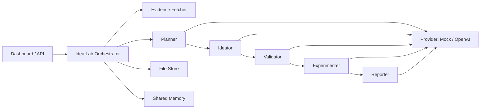

# One Person Lab

一个为 solo builder / solo founder 设计的多智能体 `idea lab`。它不再只是通用 agent demo，而是围绕三件事工作：

- 产出多个 founder-fit 的 business idea
- 用显式 rubric 和可选外部证据验证这些 idea
- 输出实验计划与最终决策报告

## What This Version Does

输入一份 founder brief 后，系统会执行固定工作流：

1. `planner`
   生成决策 north-star、success criteria 和评分 rubric。

2. `ideator`
   产出多个差异化 idea，并说明目标用户、痛点、方案、变现方式和风险。

3. `validator`
   根据 rubric 对每个 idea 打分、排序、标注证据强度与关键问题。

4. `experimenter`
   为最值得做的方向设计最低成本的验证动作。

5. `reporter`
   输出最终 recommendation、下一步动作和 Markdown 报告。

如果你提供了 URL，系统还会先抓取页面文本摘要，把这些信息作为验证证据的一部分喂给 validator 和 reporter。

## Architecture



## Core Data Model

- `IdeaBrief`
  run 的输入，包括问题、目标用户、优势、资源、约束、商业目标和证据 URL。

- `SourceEvidence`
  对外部 URL 抓取后的摘要与状态。

- `EvaluationRubric`
  显式评分标准和权重。

- `IdeaCandidate`
  ideator 生成的候选 idea。

- `ValidatedIdea`
  validator 给出的分数、风险、置信度和验证问题。

- `ValidationExperiment`
  experimenter 设计的验证动作。

- `FinalRecommendation`
  reporter 给出的最终建议。

## Project Structure

```text
public/                     Idea lab dashboard
src/domain/                 核心类型与 agent roster
src/research/               URL 证据抓取
src/llm/                    Mock/OpenAI provider
src/agents/                 ideator/validator/experimenter/reporter
src/orchestrator/           固定工作流编排
src/storage/                本地文件持久化
src/server.ts               HTTP 服务入口
```

## Quick Start

```bash
npm install
cp .env.example .env
npm run dev
```

默认使用 `mock` provider，所以不配置 API key 也能直接运行整个流程。

打开：

- [http://localhost:3000](http://localhost:3000)

## Real-Use Mode

如果你希望结果真正用于选方向，而不是只演示流程，建议：

1. 在 `.env` 中切到 `openai`
2. 填完整 founder brief
3. 尽量附上证据 URL，比如：
   竞品页面、行业文章、调研帖子、论坛讨论、用户反馈、招聘 JD

`.env` 示例：

```bash
LLM_PROVIDER=openai
OPENAI_API_KEY=your_key_here
OPENAI_MODEL=gpt-4.1-mini
```

## API

### `GET /api/meta`

返回当前 workflow、默认 provider 和可用 provider。

### `GET /api/agents`

返回当前 agent roster。

### `GET /api/runs`

返回所有历史 run。

### `GET /api/runs/:id`

返回某次 run 的完整明细。

### `GET /api/runs/:id/report.md`

导出最终 Markdown 报告。

### `POST /api/runs`

创建并异步启动一次 idea validation run。

请求体示例：

```json
{
  "title": "AI ideas for boutique agencies",
  "problem": "Boutique agencies lose margin to repetitive client operations",
  "targetUser": "Boutique agency owners",
  "marketContext": "Small service teams with weak internal tooling",
  "strengths": "Product thinking, AI prototyping, founder-led sales",
  "assets": "Network in service businesses",
  "constraints": "Part-time founder and small budget",
  "businessGoal": "Find a path to first revenue in 30 days",
  "validationGoal": "Choose the best idea to test without building a full SaaS",
  "notes": "Prefer B2B over consumer",
  "sourceUrls": [
    "https://example.com/article-1",
    "https://example.com/competitor"
  ],
  "providerMode": "mock"
}
```

## Testing

```bash
npm run build
npm run test
```

测试会验证：

- 一次 founder brief 能完整跑出 ideas、validation、experiments 和 report
- final recommendation 会被持久化
- agent roster 与当前 workflow 一致

## Current Tradeoffs

- `mock` 模式适合本地演示和测试，不适合高质量真实决策
- URL 抓取目前是轻量摘要，不是专业搜索或深度解析
- 持久化仍然是文件系统，更适合单机和早期原型

## Next Best Extensions

- 引入 schema validation，约束 OpenAI 输出稳定性
- 加入搜索 API 或数据库，增强证据质量
- 支持多轮 refinement，例如“基于 top 2 ideas 再生成更窄的 wedge”
- 支持报告模板导出为 PDF / Notion / Google Docs
- 加入 interview note ingestion，把真实用户访谈纳入验证链路
